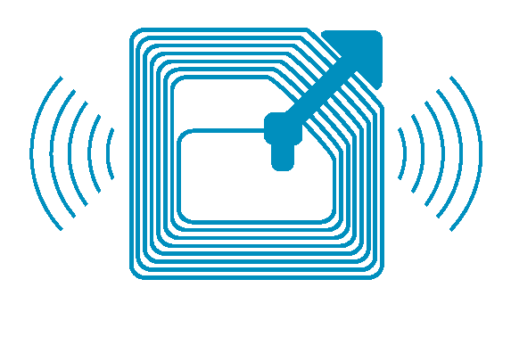

  
  <h1 align="center" style="margin: 0 auto 0 auto;">RFID</h1>
  <h5 align="center" style="margin: 0 auto 0 auto;">RFID with Arduino</h5>

  
  
  
  
  

  
  
  
  

- [Documentation](#Documentation)
- [Supported versions for releases](#Supported-versions-for-releases)
- [Arduino C++ program](#arduino-c-program)
  - [Specifications](#Specifications)
- [Sensor´s and materials list used](#sensors-and-materials-list-used)
- [Connection diagram](#connection-diagram)
- [Donations](#We-know-this-is-a-payment-project-but-consider-a-donation-for-do-more-opensource-code!!)

## The project
Code for create an lector of RFID with an arduino. This code only read the tag of the RFID key so you can perform an action like authorize a card to do something and not authorize a card, etc.

## Documentation
We are developing a github page in the wiki part in order to use that space as a documentation, that documentation page will be builded with the time but all code has comments in order to be used as documentation for each method created in the project just for now. [Click here](https://github.com/dmtzs/PN532-Arduino/wiki) in order to go to the home page of the documentation in the wiki.
 
Also please see below the list of the hardware which are going to be used in this project.

## Supported versions for releases
To see the releases supported versions please [click here](https://github.com/dmtzs/PN532-Arduino/blob/master/SECURITY.md) to see the supported ones and unsupported ones.

## Arduino C++ program
The Arduino is going to be used for manage the cards that are authorized to do something, of course in this code I have my own credentials but should be changed by the ones you want.
Also is better to implement a way to add more cards and that functionality is going to be developed with time and more.

### Specifications
This libraries should be installed only if you want to develop by yourself the arduino, if not it is not neccesary.

## Sensor´s and materials list used
Still in development

## Connection diagram
Still in development

# Enjoying this app? Consider a donation!!
This project is an opensource and free project. That doesn't mean we don't need any money.

Please consider a donation to help us cover the ongoing costs like keep improving functionality in this app. If we receive enough donations we might even be able to free up some working hours and spend some extra time improving the platform core and adding more functionalities.

To donate, please follow this [link](https://ceneka.net/dmtzs).

Also with the time I will be adding a way to donate using some criptocurrency.
